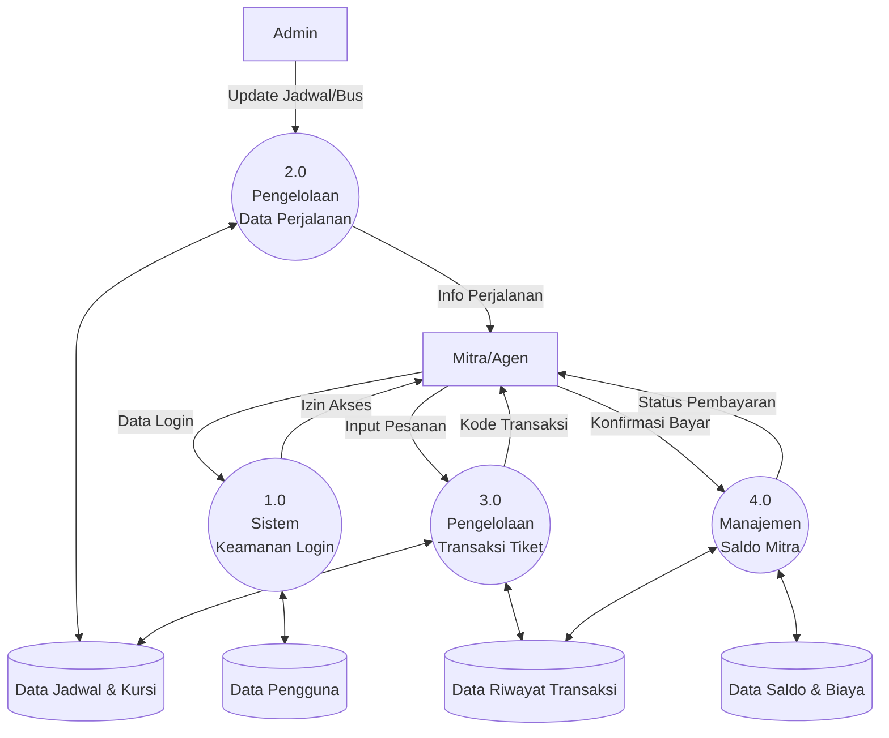

# Visualisasi Sistem: Flowchart & DFD (Conceptual Version)

Dokumen ini berisi visualisasi sistem yang menjelaskan alur kerja dan aliran data pada aplikasi Backend Tiket Bus secara logis dan mudah dipahami, tanpa menggunakan istilah teknis pemrograman yang rumit.

---

## 1. Flowchart: Alur Proses Pembelian Tiket
**Analisis**: Alur ini memastikan bahwa setiap pembelian tiket melalui tahapan validasi yang ketat, mulai dari pengecekan ketersediaan kursi hingga kecukupan saldo mitra sebelum tiket resmi diterbitkan.

```mermaid
graph TD
    A([Mulai]) --> B[Login ke Sistem]
    B --> C[Cari Jadwal Perjalanan <br/>(Asal, Tujuan, Tanggal)]
    C --> D{Jadwal Tersedia?}
    D -- Tidak --> C
    D -- Ya --> E[Lihat Denah Kursi & Pilih Kursi]
    E --> F[Input Data Penumpang & Buat Reservasi]
    F --> G[Sistem Menghitung Total Biaya <br/>(Harga Tiket + Biaya Layanan)]
    G --> H[Status: Menunggu Pembayaran]
    H --> I[Proses Pembayaran Menggunakan Saldo]
    I --> J{Saldo Mencukupi?}
    J -- Tidak --> K[Transaksi Dibatalkan / Saldo Kurang]
    J -- Ya --> L[Saldo Terpotong & Status: Terbayar]
    L --> M[Penerbitan Tiket Digital]
    M --> N[Tiket Selesai & Siap Dicetak]
    N --> O([Selesai])
```

---

## 2. DFD Level 0: Diagram Konteks (Sistem Utama)
**Analisis**: Sistem ini bertindak sebagai pusat pengelolaan data yang menghubungkan **Admin** sebagai pengelola seluruh armada dan jadwal, serta **Mitra** sebagai pihak yang melakukan penjualan tiket ke penumpang.

```mermaid
graph LR
    subgraph Sistem_Informasi_Tiket_Bus
        S[((Aplikasi Pengelolaan Tiket Bus))]
    end

    Admin[Entitas: Admin] -- Kelola Data Kota, Rute,<br/>Bus, dan Jadwal --> S
    S -- Laporan Penjualan &<br/>Riwayat Transaksi --> Admin

    Mitra[Entitas: Mitra/Agen] -- Pengisian Saldo,<br/>Pemesanan Tiket, &<br/>Konfirmasi Pembayaran --> S
    S -- Informasi Tiket,<br/>Sisa Saldo, &<br/>Status Transaksi --> Mitra
```

---

## 3. DFD Level 1: Diagram Aliran Data (Proses Bisnis)
**Analisis**: Sistem membagi tugas menjadi empat proses utama untuk memastikan data keamanan pengguna, ketersediaan data master, kelancaran transaksi, dan keakuratan saldo tetap terjaga.



---

## Glosarium (Istilah Penting)
Untuk mempermudah penjelasan saat ditanya penguji, gunakan istilah berikut:
- **Admin**: Pengelola sistem yang mengatur data dasar seperti bus dan jadwal keberangkatan.
- **Mitra/Agen**: Pengguna sistem yang melayani pembeli tiket dan memiliki deposit saldo.
- **Biaya Layanan**: Biaya tambahan di luar harga tiket untuk pemeliharaan sistem.
- **Reservasi**: Proses mengunci kursi sementara sebelum dibayar.
- **Saldo Deposito**: Modal yang dimiliki mitra di dalam sistem untuk bertransaksi.

---

## Logika Bisnis Utama (Tips Penguji)
Poin-poin ini bisa Anda gunakan untuk menjelaskan "kenapa sistem dibuat seperti ini":
1.  **Keamanan Berlapis**: Setiap pengguna harus login agar identitas pemesan tiket terekam dengan jelas.
2.  **Validasi Saldo**: Pembayaran dilakukan secara otomatis melalui potongan saldo untuk mempercepat proses tanpa perlu transfer manual setiap kali pesan tiket.
3.  **Akurasi Kursi**: Sistem memastikan satu kursi hanya bisa dipesan oleh satu orang pada jadwal yang sama untuk menghindari bentrokan (*double booking*).
4.  **Skalabilitas**: Sistem dirancang agar dapat menangani banyak kota dan rute dengan mudah hanya melalui pengaturan di sisi Admin.
