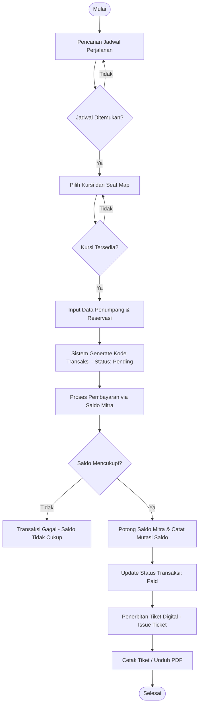
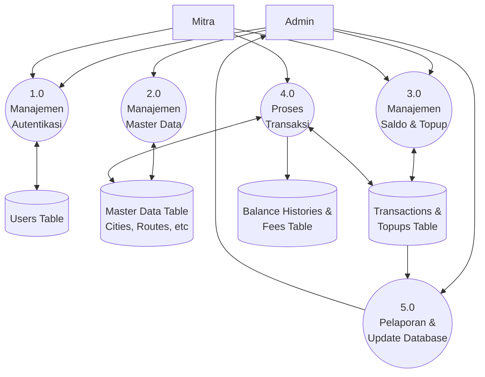

# Visualisasi Sistem: Flowchart & DFD

Dokumen ini berisi visualisasi sistem yang dirancang untuk memberikan pemahaman mendalam mengenai alur kerja dan aliran data pada aplikasi Backend Tiket Bus.

---

## 1. Flowchart: Alur Reservasi & Pembayaran Tiket (Core Business Logic)
**Analisis**: Alur ini menggunakan sistem *atomic transaction* di mana pemotongan saldo mitra hanya dilakukan setelah validasi kursi dan saldo berhasil, guna mencegah kegagalan sinkronisasi data keuangan.



---

## 2. DFD Level 0 (Context Diagram)
**Analisis**: Diagram ini menunjukkan bahwa sistem bertindak sebagai entitas pusat yang mengelola pertukaran informasi terenkripsi antara Admin (manajer data) dan Mitra (operator penjualan) secara real-time.

```mermaid
graph LR
    subgraph Sistem_Pemesanan_Tiket_Bus
        S[((Aplikasi Backend Tiket Bus))]
    end

    Admin[Entitas: Admin] -- Kelola Master Data,\nApprove Topup,\nMonitor Laporan Keuangan --> S
    S -- Laporan Rekapitulasi,\nNotifikasi Sistem --> Admin

    Mitra[Entitas: Mitra] -- Request Topup Saldo,\nReservasi Tiket,\nOtorisasi Pembayaran --> S
    S -- E-Ticket,\nInformasi Sisa Saldo,\nStatus Transaksi --> Mitra
```

---

## 3. DFD Level 1 (Diagram Proses Internal)
**Analisis**: Pemisahan modul menjadi lima proses utama memastikan sistem memiliki *high cohesion* dan *low coupling*, sehingga memudahkan skalabilitas dan audit pada setiap fungsi bisnis (Auth, Master Data, Finance, Transaction, Reporting).



---

## Standar Penamaan & Istilah (Glossary)
Untuk menjaga konsistensi pada laporan, gunakan istilah berikut:
- **Admin**: Pengguna dengan hak akses penuh untuk mengelola data master dan keuangan.
- **Mitra**: Agen atau pihak ketiga yang melakukan penjualan tiket menggunakan sistem saldo.
- **Master Data**: Kumpulan data dasar (Kota, rute, bus, jadwal).
- **Topup**: Proses pengisian ulang saldo Mitra.
- **Reservasi**: Proses pemesanan kursi sebelum pembayaran dilakukan.
- **Issue Ticket**: Proses penerbitan tiket resmi setelah pembayaran dikonfirmasi.

---

## Penjelasan Singkat
1.  **Flowchart**: Menekankan pada validasi saldo dan ketersediaan kursi sebelum transaksi dianggap sukses.
2.  **DFD Level 0**: Memposisikan aplikasi sebagai pusat aliran informasi antara Admin (penyedia data/pengawas) dan Mitra (pengguna/penjual).
3.  **DFD Level 1**: Membagi beban kerja sistem ke 5 area utama (Auth, Master Data, Finance, Transaction, Reporting) yang semuanya saling terintegrasi melalui database.
